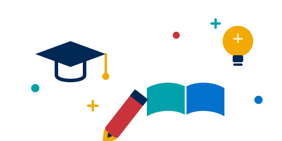

# SEM — Eğitim Listeleme Sayfaları: Kart Tasarımı A/B Denemesi

> **Amaç:** İki kart tasarım yönünü aynı anda canlıda görüp karşılaştırmak. Beğenilen yön sonradan **iki sayfaya birden** uygulanır. Bu dosya `tum-kurslar.html` ve `hizmet-ici-egitimler.html` sayfalarının kart/ızgara işini kapsar. (Anasayfa sırası, menü ve Sınav Merkezleri değişiklikleri `REVIZE-BRIEF.md` içindedir — burada tekrarlanmaz.)
>
> **Genel kural:** Vendor dosyalarına dokunma. Stiller `assets/css/sem-custom.css` içine. Renkler `--sem-*` / `--kun-*` değişkenlerinden.

---

## Deneme kurgusu — hangi yön hangi sayfada
| Sayfa | Yön | Kart yapısı |
|-------|-----|-------------|
| **Eğitimler** — `tum-kurslar.html` | **A — Özet metinli** | Görsel (4:5) → rozet → başlık → **kısa açıklama (2 satır)** → meta → footer |
| **Hizmet İçi** — `hizmet-ici-egitimler.html` | **B — Özetsiz sade** | Görsel (4:5) → rozet → başlık → meta → footer |

> İki yön kolayca takas edilebilir; hangisinin nereye geldiği kritik değil, amaç yan yana görmek. Karar sonrası kazanan yön diğer sayfaya da kopyalanır.

---

## Ortak temel (HER İKİ sayfaya da uygulanır)

### 1. Izgara 3 sütun (filtre sidebar'a DOKUNMA)
- Izgara **3 sütun** (`course-grid-3`). 4'lü yapıldıysa geri döndür.
- **⚠️ Filtre sidebar'ı kullanıcı tarafından elle düzeltildi — sidebar kolon oranına, genişliğine, filtre tipografisine DOKUNMA.** Mevcut hâli korunacak.
```css
/* 3'lü ızgara oranları (sadece ızgara; sidebar'a dokunma) */
.rbt-course-grid-column .course-grid-3{ width:33.333%; }
@media (min-width:768px) and (max-width:991px){ .rbt-course-grid-column .course-grid-3{ width:50%; } }
@media (max-width:767px){ .rbt-course-grid-column .course-grid-3{ width:100%; } }
```

### 2. Görsel oranı — 4:5 dikey (Instagram post, 1080×1350)
```css
.sem-course-card .rbt-card-img,
.rbt-card.variation-01 .rbt-card-img{ aspect-ratio:4/5; overflow:hidden; }
.sem-course-card .rbt-card-img img{ width:100%; height:100%; object-fit:cover; display:block; }
```
> Görseller 4:5 değilse `object-fit:cover` ile kırpılır; yeni dikey görsel (1080×1350) hatırlatması yapılır.

### 3. Kart kontrastı + sayfa zemini — KİLİTLENDİ: gri (#f8f9fa, hakkımızdaki gibi)
**Sorun (canlıda görüldü):** Sayfa beyaz + kart beyaz + soluk kenarlık (0.10) + gölge yok = kartlar zemine karışıyor ("her şey beyaz, anlaşılmıyor").

**Çözüm (canlıda onaylandı):** Zemin **#f8f9fa** (hakkımızdaki gri). Body zemini artık **site geneli #f8f9fa** (bkz. `REVIZE-BRIEF.md` madde 2c) — bu sayfalarda ayrıca body kuralı gerekmez. Kum yönü elendi. Beyaz kartlar bu gri üzerinde net ayrışır:
```css
/* Kartlar beyaz + gri (#f8f9fa) zemin üzerinde net ayrışma */
.sem-course-card{
  background:#fff;
  border:1px solid rgba(0,40,85,.14);
  box-shadow:0 1px 4px rgba(0,40,85,.06);
}
.sem-course-card:hover{
  transform:translateY(-3px);
  box-shadow:0 6px 18px rgba(0,40,85,.12);
  border-color:rgba(0,40,85,.26);
}
/* Durum rozeti: kurumsal solid pill, kart gövdesinde BAŞLIĞIN ÜSTÜNDE
   (görsel üstünde belirsiz kalıyordu; anasayfa ile aynı; kum elendi) */
.sem-status-badge{
  position:static; display:inline-block; width:auto; margin:0 0 10px;
  padding:5px 12px; font-size:12px; font-weight:600; border:none; border-radius:0;
  color:#fff; background:var(--sem-primary,#002855);
}
.sem-status-badge::before{ display:none; }
.sem-status-badge--acik   { background:var(--sem-success,#1a7a4a); }
.sem-status-badge--son    { background:var(--kun-sari,#F2A900); color:var(--sem-primary,#002855); }
.sem-status-badge--yakinda{ background:var(--kun-gri,#53565a); }
.sem-status-badge--kapandi{ background:var(--sem-accent,#cb333b); }
.sem-status-badge--talep  { background:var(--kun-mavi,#0072ce); }
```

### 4. Başlık hizalama + dikey flex (her iki yönde de simetri)
```css
.sem-course-card .rbt-card-title{
  display:-webkit-box; -webkit-line-clamp:2; -webkit-box-orient:vertical;
  overflow:hidden; min-height:2.8em; line-height:1.4; margin-bottom:.6rem;
}
.sem-course-card .rbt-meta{ min-height:1.6em; margin-bottom:0; }
.sem-course-card{ display:flex; flex-direction:column; height:100%; }
.sem-course-card .card-body{ flex:1 1 auto; }
.sem-course-card .card-footer{ margin-top:auto; }
```

---

## Yön A — Özet metinli (uygula: `tum-kurslar.html`)
- Kart içindeki `<p class="rbt-card-text">…</p>` **KALIR**.
- Açıklama 2 satıra sabitlensin (uzun/kısa fark etmeden hiza korunur):
```css
/* Yön A: açıklama 2 satır clamp (yalnız tum-kurslar'da element mevcut) */
.sem-course-card .rbt-card-text{
  display:-webkit-box; -webkit-line-clamp:2; -webkit-box-orient:vertical;
  overflow:hidden; min-height:2.6em; margin-bottom:.6rem;
}
```

## Yön B — Özetsiz sade (uygula: `hizmet-ici-egitimler.html`)
- Her karttaki `<p class="rbt-card-text">…</p>` satırını **HTML'den KALDIR** (12 kart).
- Ek CSS gerekmez; ortak temel + başlık clamp yeterli. Kartı görsel + başlık + meta taşır.
> Not: Yukarıdaki Yön A `.rbt-card-text` kuralı bu sayfada element olmadığı için etkisizdir; global kalması sorun çıkarmaz.

---

## Sayfa banner'ı ("slider") — KİLİTLENDİ: Gri (#f8f9fa) + boyut küçültme + animasyonlu eğitim motifi
**Dosyalar:** `tum-kurslar.html`, `hizmet-ici-egitimler.html` + `sem-custom.css`.

### a) Boyut — hakkımızdaki ölçüye indir (canlıda ölçüldü)
Mevcut banner **522px** (padding 60px üst / **200px alt** — kartlar negatif margin ile banner'a taşıyor). Hedef: `sem-hakkinda.html` hero'su = **~215px, `padding:48px 0`, `background:#f8f9fa`**, içinde sadece breadcrumb + başlık (+ kısa açıklama).
- `.rbt-page-banner-wrapper` padding'ini **`48px 0`** yap; 200px alt padding'i kaldır.
- **Toolbar'ı banner'ın DIŞINA taşı:** `rbt-course-top-wrapper` (Izgara/Liste + Sıralama + "1-9/19 sonuç") banner içinden çıkıp, sidebar+grid satırının **hemen üstünde** normal akışta durmalı. (Canlı testte banner içindeyken sidebar'a taşıyor.)
- Grid/görünüm alanının negatif üst margin taşmasını sıfırla (kartlar artık banner'a binmeyecek).
```css
.rbt-page-banner-wrapper{ padding:48px 0 !important; }
.rbt-page-banner-wrapper .rbt-banner-image{ background:#f8f9fa !important; position:relative; overflow:hidden; }
.rbt-page-banner-wrapper .rbt-banner-image::after{ display:none !important; }
.rbt-page-banner-wrapper .rbt-banner-content-top .title{ color: var(--sem-primary) !important; }
.rbt-page-banner-wrapper .page-list a,
.rbt-page-banner-wrapper .page-list li,
.rbt-page-banner-wrapper .page-list .active,
.rbt-page-banner-wrapper .description{ color: var(--kun-gri, #53565a) !important; }
```

### b) Animasyonlu eğitim motifi (Kapadokya DEĞİL — eğitim temalı, canlı, mobil-güvenli)
Balon motifi elendi. Yeni motif: **eğitimi anlatan** (mezuniyet kepi, açık kitap, ampul/fikir, kalem + bilgi noktaları), **canlı kurumsal renkler**, hafif yüzen animasyon. Hazır SVG dosyası (CSS animasyon gömülü, `prefers-reduced-motion` destekli, `viewBox` ile ölçeklenir → mobilde bozulmaz):
`assets/images/banner/sem-egitim-motif.svg`
```html
<!-- banner wrapper'ın içine (sağ üst); metnin soluyla çakışmaz -->

```
- Mobilde: `height` küçült / çok dar ekranda gizle (isteğe bağlı) — `@media (max-width:575px){ .banner-motif{ display:none; } }`.
- Eski `sem-balon-motif.svg` artık kullanılmıyor (silinebilir).

### c) (Opsiyonel) Video arka plan — motionsites.ai
Kullanıcının önerdiği `motionsites.ai/backgrounds` videoları premium (abonelik) + istemci-render; üçüncü-taraf barındırmalı video banner mobilde ağırdır ve lisans/erişim bağımlılığı yaratır. **Önerilmez.** İstenirse: seçilen mp4 kendi sunucumuza indirilip `<video autoplay muted loop playsinline>` ile banner'a, `#f8f9fa` üstüne konur; ölçü = About hero yüksekliği (~215px). Ana çözüm animasyonlu SVG.

---

## Eğitim görselleri (açık/aydınlık tonlu) — kart görselleri için
Kategorilere uygun, açık tonlu görseller (Unsplash — ücretsiz lisans). URL'lere `?w=1080&h=1350&fit=crop&q=80` eklenmiştir → doğrudan **4:5 dikey** kırpılmış gelir. Kart görsellerinde bu URL'ler kullanılabilir; istenirse dosyalar indirilip `assets/images/course/` altına konur. Kart başına birini seç.

**Yabancı Dil**
- `https://images.unsplash.com/photo-1546410531-bb4caa6b424d?w=1080&h=1350&fit=crop&q=80`
- `https://images.unsplash.com/photo-1565022536102-f7645c84354a?w=1080&h=1350&fit=crop&q=80`

**Havacılık**
- `https://images.unsplash.com/photo-1541611666598-71d25303fb88?w=1080&h=1350&fit=crop&q=80`
- `https://images.unsplash.com/photo-1494264274944-1ba7d9b73135?w=1080&h=1350&fit=crop&q=80`

**Gastronomi & Aşçılık**
- `https://images.unsplash.com/photo-1577219491135-ce391730fb2c?w=1080&h=1350&fit=crop&q=80`
- `https://images.unsplash.com/photo-1565608087341-404b25492fee?w=1080&h=1350&fit=crop&q=80`

**İlk Yardım / Sağlık**
- `https://images.unsplash.com/photo-1649260257572-91bf6f94cff6?w=1080&h=1350&fit=crop&q=80`
- `https://images.unsplash.com/photo-1734174040265-ef440f9373dc?w=1080&h=1350&fit=crop&q=80`

**Sağlık & Spor**
- `https://images.unsplash.com/photo-1571019613454-1cb2f99b2d8b?w=1080&h=1350&fit=crop&q=80`
- `https://images.unsplash.com/photo-1517836357463-d25dfeac3438?w=1080&h=1350&fit=crop&q=80`

**Bilgi Teknolojileri**
- `https://images.unsplash.com/photo-1518818608552-195ed130cdf4?w=1080&h=1350&fit=crop&q=80`
- `https://images.unsplash.com/photo-1563172218-cc4b58795905?w=1080&h=1350&fit=crop&q=80`

**Turizm**
- `https://images.unsplash.com/photo-1488646953014-85cb44e25828?w=1080&h=1350&fit=crop&q=80`
- `https://images.unsplash.com/photo-1503221043305-f7498f8b7888?w=1080&h=1350&fit=crop&q=80`

**Kişisel Gelişim & Sanat / Seminer**
- `https://images.unsplash.com/photo-1523580494863-6f3031224c94?w=1080&h=1350&fit=crop&q=80`
- `https://images.unsplash.com/photo-1638957835514-224c57ffe617?w=1080&h=1350&fit=crop&q=80`

> Not: Görseller açık-tema kategorilerinden seçildi; nihai "açıklık" tercihini kart yerleşiminde göz kontrolüyle doğrula. Kırık görselli kartlar (Aşçılık, Turizm vb.) öncelikle bunlarla değiştirilebilir.

---

## Hizmet İçi — hedef kitle metni (`hizmet-ici-egitimler.html`)
- **Eski:** "Bu eğitimler yalnızca Kapadokya Üniversitesi öğrenci, mezun ve personeline yöneliktir."
- **Yeni:** "Bu eğitimler yalnızca Kapadokya Üniversitesi personeline yöneliktir."
- `<meta name="description">` içindeki "öğrenci, mezun ve personeline" → "personeline".

---

## Doğrulama
- Banner ölçüsü ≈ hakkımızdaki hero (~215px, padding 48px); toolbar banner dışına taşındı, kartlar banner'a binmiyor.
- Banner zemini #f8f9fa; sağ üstte animasyonlu eğitim motifi çalışıyor; motif mobilde bozulmuyor/ölçekleniyor.
- Her iki sayfa: 3 sütun ızgara (sidebar'a dokunulmadı), 4:5 görsel, kartlar #f8f9fa üzerinde belirgin ve hizalı.
- Kart görselleri: kırık görseller md'deki Unsplash 4:5 URL'leriyle değiştirildi.
- `tum-kurslar` → Yön A (kısa açıklama 2 satır); `hizmet-ici` → Yön B (açıklama yok).
- Hizmet içi metni "sadece personel". Butonlar turkuaz + sarı hover (ana brief).
- Karşılaştır → beğenilen kart yönünü diğer sayfaya da uygula.
